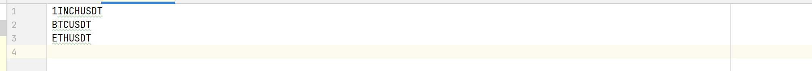

## Back Test для стратегий на исторических данных Binance

### Важно

Лучше написать в Telegram @AccNFR и подождать несколько минут, скорее всего я смогу созвониться и объяснить как все
работает. Только иначе стоит читать то, что написано дальше.

### Как это вкратце работает?

Бектестер запускается как отдельный исполняемый файл. Ваша программа создает файл с сигналами и уведомляет об этом
бектестер через сокет. Как только бектестер принимает стратегию, он ее
тестирует, создает файл со сделками, уведомляет об этом вашу программу. Далее ваша программа читает этот файл и, таким
образом, получает результаты стратегии.

### Начало работы.

1. Склонируйте проект.
2. Заполните конфигурационный файл ```config.json```. Предварительно заполненный шаблон находится в корне проекта.

   ```port``` - порт, на котором запускается сервер для общения бектестера и вашей программы. Чтобы не менять порт на
   клиенте, лучше оставить 8000

   ```baseAsset``` - валюта, относительно которой происходит тестирование. Если это USDT, то можно оставить все как
   есть в шаблоне, то есть "USDT".

   ```timeframe``` - таймфрейм для тестирования. Лучше поставить "1m", но нужно для этого скачать данные с Binance.

   ```startYear``` - год начала тестирования, включительно.

   ```startMonth``` - месяц начала тестирования, включительно.

   ```endYear``` - год конца тестирования, включительно.

   ```endMonth``` - месяц начала тестирования, не включительно.

   ```baseFundAtStart``` - количество средств изначально.

   ```fee``` - комиссия за сделку.

   ```isReinvest``` - реинвестируем?

   ```isLoadReport``` - выводим ли csv-файлы для отчета после теста? Протокол отчетов совпадает с протоколом Ивана.

   ```isLoadReport``` - выводим ли csv-файлы для отчета после теста? Протокол отчетов совпадает с протоколом Ивана.

   ```reportDirectoryPath``` - абсолютный путь до директории, где создавать файлы для отчета.

   ```dataDirectoryPath``` - абсолютный путь до директории, хранятся данные с Binance.

   ```pairsFilePath``` - абсолютный путь до файла, где хранятся интересующие валютные пары для тестирования.
   Здесь очень важен формат файла. Как в примере ниже.
    То есть в конце должна быть пустая строка.
3. Запустите бектестер.

   Для этого нужно в директории release найти исполняемый файл для своей OS.
   Например, для Windows это будет main.exe.

   Затем ввести в терминале команду запуска:

   ```.\main.exe path```, где вместо строки path находится абсолютный пусть до файла config.js.
   Например, в моем случае, запуск на Windows выглядит так: ```.\main.exe D:\business\backtester\config.json```.
   Замечание: config.js можно менять прямо во время работы бектеста.

### Тестирование. Python

Пока что реализован удобный клиент для вызова бектеста на языке Python. Файл с клиентом находится по пути в директории
проекта ```/client/python/backtest.py```.
Пример ```example.py``` простой стратегии из последовательных 100 000 сигналов на вступление в Long находится в той же
директории.

Стратегия - временной список сигналов на открытие Long-позиции; открытия Short-позиции; закрытия позиции; закрытия
позиции, если
сейчас
Short; закрытия позиции, если сейчас Long. Рассмотрим подробнее параметры стратегии (лучше, чтобы перед глазами был
example.py):

```StrategyEvent``` - структура, содержащая параметры сигнала стратегии. Таким образом тип стратегии -
List[StrategyEvent]

Теперь разберем параметры StrategyEvent-а.

```timestamp``` - временная метка в секундах (UTC, unix time), которая указывает, а какой момент подается сигнал.

```is_close_long``` - если true, то сигнал на принудительное закрытие сигнала, ели сейчас Long-позиция. Иначе, событие
игнорируется*.

```is_close_short``` - если true, то сигнал на принудительное закрытие сигнала, ели сейчас Short-позиция. Иначе, событие
игнорируется*.

(*) Важно: Если ```is_close_short=True``` и ```is_close_long=True```, то позиция закрывается в любом случае.
Если оба этих флажка false, а позиция открыта, то сигнал на открытие новой проигнорируется.

```position``` - может быть либо "L", либо "S". Это позиция, в которую мы встаем.

```close_position_options``` - опции выхода из позиции.
Это набор структур ```ClosePositionOption```, каждая из которых также находится в файле backtest.py. Каждая такая
структура указывает

* ```take_profit``` - тейк-профит, причем это абсолютный процент от цены входа в позицию. Таким образом, если позиция
  Short, то тейк-профит должен быть меньше 1, если Long, то больше.
* ```stop_loss``` - стоп-лосс, также абсолютный процент от цены входа.
* ```is_fixed``` - двигается ли стоплосс при благоприятном росте цены?

При достижении ценой стоп-лосса, позиция закрывается. При достижении ценой тейк-профита стоп-лосс и тейк-профит
меняются, как в следующей ClosePositionOption.

**Важно:** стоп-лоссы и тейк-профиты считаются относительно начальной цены,
для всех ClosePositionOption.

После того как вы создали list[StrategyEvent], нужно отправить стратегию на проверку.

Для этого нужно вызвать функцию test из модуля backtest.

```python
res = test(
    swap_path="D:\\swap", # путь,
    # где создаются файлы для обмена вышей программы и бектестера
    coin="BTC",  # монета, которую тестируем
    strategy=simple_strategy,  #  list[StrategyEvent]
)
```

Возвращается list[Trade], где Trade - класс сделки
```python
class Trade:
    def __init__(self):
        self.openTime  # время открытия, сек
        self.closeTime  # время закрытия, сек
        self.position  # позиция
        self.fundBefore  # сумма входа в quote currency
        self.fundAfter  # сумма выхода в quote currency
        self.reward  # абсолютная награда
```

   
   
   

